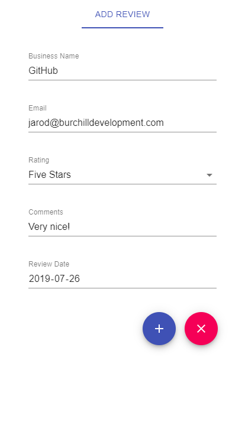
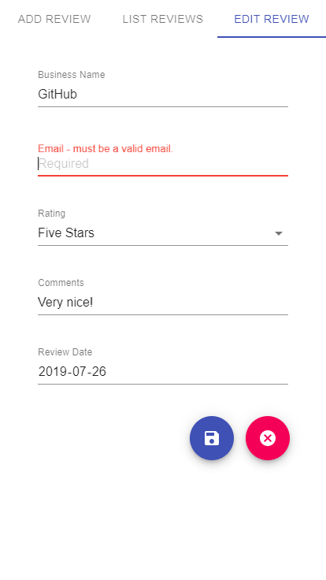

# Review React App
Business review react app with form validation and full CRUD functionality. Styled using Google's Material UI.
## What I Learned:
- Conditional component rendering
- Live form validation in React
- Create, Read, Update and Delete (CRUD) functionality in React
- Creating user interfaces with Google Material UI
## GitHub Pages:
### Link:
https://jarodburchill.github.io/review-react-app
### Preview:



## Installation: 
```
git clone https://github.com/jarodburchill/review-react-app
cd review-react-app
npm install
npm start
```
